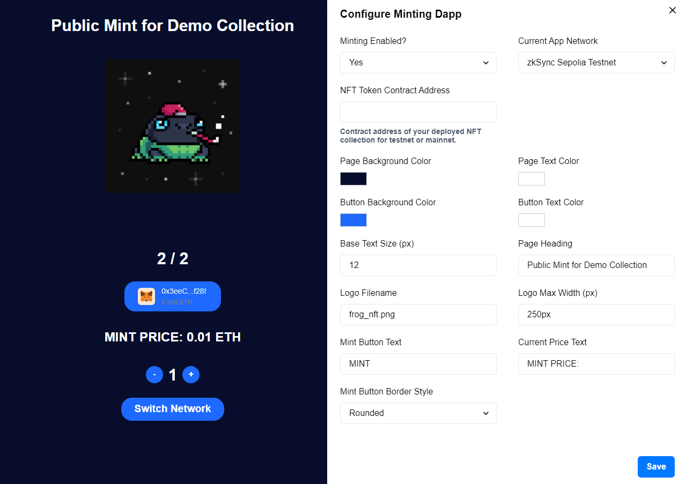

##  zksync-minting-dapp

&nbsp;



&nbsp;

Configurable zkSync minting dapp that you can plug into any non-related project without any dependencies or iframes. Allows rich configuration via UI and the ability to modify the dapp code as well if you have basic knowledge in HTML and CSS.

1\. This repo uses Thirdweb SDK to manage the mint process. In order to deploy your smart contract visit thirdweb NFT Drop contract page and deploy on testnet / mainnet, do lazy premint of your NFTs with metadata and set your claim phases: https://thirdweb.com/thirdweb.eth/DropERC721. Full tutorial will follow! ✍️

2\. Install Node.js on your computer or server.

3\. Clone this project from the repository and install its dependencies:

```bash
npm install
```

4\. Copy **config.example.js** to **config.js**

5\. Build the project for development:

```bash
npm run dev
```

6\. Configure your minting dapp from UI interface and once you're ready, build it for deployment using this command:

```bash
npm run build
```

7\. If your mint is going public after testing, make sure you set the **config.showConfigurationPanel** to **false** in order to hide it.

8\. Then export the minting dapp as a static HTML / CSS / JS website so it doesn't require you to host it on a server with Node.js, this way you can even use a simple shared hosting for deployment! Use the following command:

```bash
npm run export
```

9\. After exporting you will see a new folder created inside your root directory called - **/out**. Just copy the contents of this folder to your hosting provider of choice and you're ready to go! If you require any changes to your minting dapp, change them locally and re-deploy.

#

*If you need any custom development or consultancy for your project you can contact me at **0xiliyan** on Discord.* 
